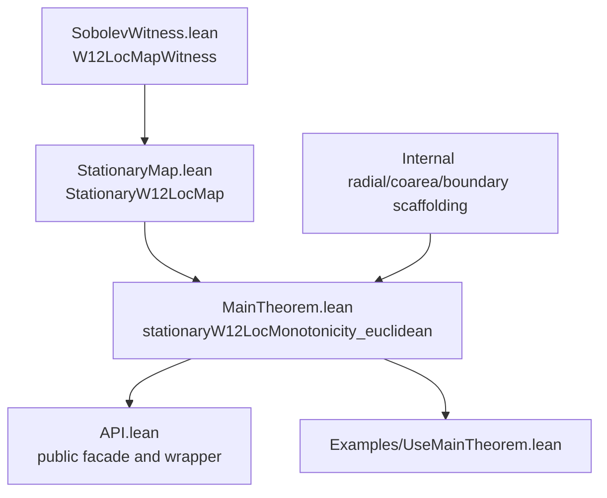
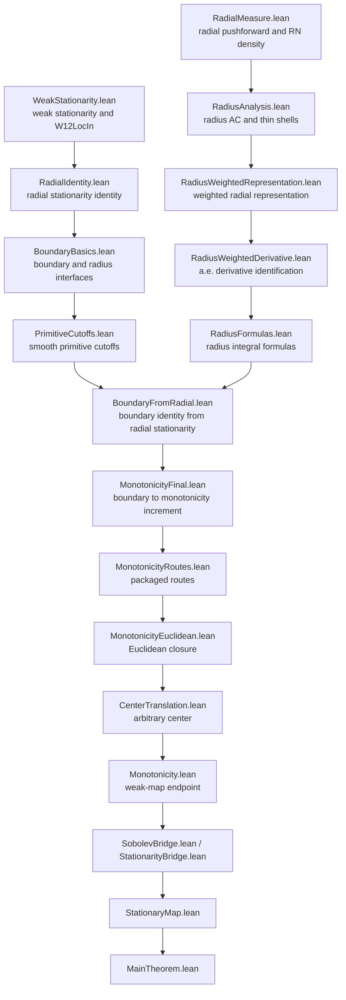

# Paper Outline

This note is a writing scaffold for a short article or project report about the
formalization. It separates the final theorem from the internal radial/coarea
route so that readers can see what is assumed, what is proved in Lean, and what
comes from mathlib.

## Mathematical Statement

Let `u : Omega -> R^m` be a domain-variation stationary Sobolev map on a
measurable domain `Omega subset R^n`, with chosen weak gradient `Du`. Assume:

* `u` is locally in `L^2`.
* `Du` is a.e. strongly measurable and locally in `L^2`.
* `Du` is the distributional weak gradient of `u`.
* The domain first variation of the Dirichlet energy vanishes against compactly
  supported `C^1` vector fields.
* `closedBall(a, R0) subset Omega`.

Then for `0 < s <= r < R0`,

```text
Theta(Du, a, s) <= Theta(Du, a, r),
```

where `Theta(Du, a, rho) = rho^(2-n) * integral_{B(a,rho)} |Du|^2`.

The proof is target independent: it uses the weak gradient and domain
variation, but not a target-manifold constraint. A manifold-valued stationary
map can be treated later by a thin wrapper that supplies the same stationary
Sobolev witness.

## Lean Statement

The preferred Lean theorem is:

```lean
stationaryW12LocMonotonicity_euclidean
```

from:

```lean
import LeanStationaryHarmonicMaps.StationaryHarmonicMap.MainTheorem
```

Its input package is:

```lean
StationaryW12LocMap u Omega
```

and its conclusion is:

```lean
weakTheta hmap.w12.weakGrad a s <= weakTheta hmap.w12.weakGrad a r
```

The witness package records the chosen weak gradient explicitly. This mirrors
the engineering choice in the De Giorgi-Nash-Moser formalization, where the
Sobolev layer is project-defined and built from weak derivatives and `MemLp`
rather than relying on a monolithic mathlib Sobolev object.

## Public Dependency Graph



## Internal Proof Route



## Comparison With The DGM Sobolev Approach

The De Giorgi-Nash-Moser project defines its own Sobolev predicates and
witnesses around weak derivatives, `MemLp`, approximation, and zero-trace
interfaces. This project follows the same broad strategy, but with a much
lighter Sobolev layer:

| DGM-style idea | This project |
| --- | --- |
| Weak derivatives are project-defined. | `DistributionalWeakGradientIn` and `HasWeakGradientIn`. |
| Sobolev membership carries witnesses. | `W12LocMapWitness` carries `weakGrad`. |
| PDE hypotheses are bundled. | `StationaryW12LocMap` bundles Sobolev data and first variation. |
| Public theorem hides proof-route plumbing. | `MainTheorem.lean` hides radial/coarea/boundary scaffolding. |

The difference is scope. DGM needs Sobolev-Poincare, iteration, truncations, and
zero-trace approximation. The monotonicity formula here only needs local `L^2`,
a displayed weak gradient, and domain-variation stationarity.

## Target-Independence

The monotonicity proof never uses:

* a target submanifold;
* tangent-space projection;
* a second fundamental form;
* an Euler-Lagrange equation into a manifold.

It uses only the stress-energy/domain-variation identity written in terms of the
displayed weak gradient. This makes the Euclidean-target statement the right
core theorem. A future manifold wrapper should prove that a particular embedded
manifold-valued notion of stationarity supplies a `StationaryW12LocMap` and
then call `stationaryW12LocMonotonicity_euclidean`.

## Non-goals

This project deliberately does not formalize:

* a full manifold-valued Sobolev theory;
* heat flow for maps;
* regularity or epsilon-regularity;
* partial regularity;
* a general-purpose Sobolev library.

These exclusions are not temporary gaps in the monotonicity proof. They keep
the API focused on the domain-variation theorem and prevent the public
statement from depending on heavier theories that the proof itself never uses.

## Limitations And Future Wrapper

Current limitations:

* The target is Euclidean in the formal theorem.
* Manifold-valued maps are not yet packaged as a public wrapper.

Possible future wrapper:

```lean
structure EmbeddedTargetStationaryMap where
  toStationaryW12LocMap : StationaryW12LocMap u Omega
  target_constraint : ...

theorem EmbeddedTargetStationaryMap.monotonicity ... :=
  stationaryW12LocMonotonicity_euclidean ...
```

The wrapper should be thin: it should not reopen the radial monotonicity proof.
